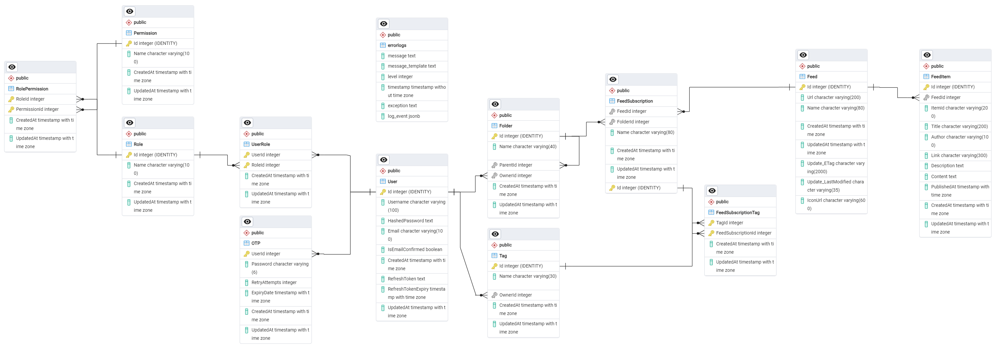
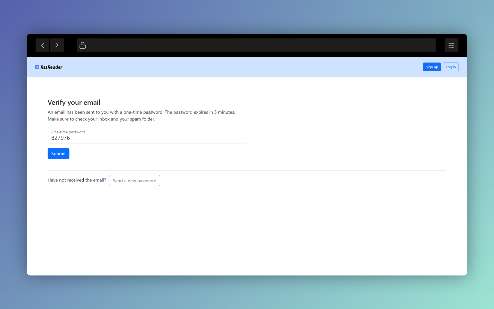

# RssReader
   

_.Net minimal API_ coupled with a simplistic _Angular frontend_ dedicated to susbcribing and reading RSS feeds

Features
- Folder- and tag-based organization of RSS feed subscriptions
- Folder-, tag-, RSS feed-specific filtering of the user's dashboard feed

## API
To explore the API endpoints, use the [Swagger editor](https://editor.swagger.io/) to read the [documentation](Misc/api-documentation.json).

Points of note regarding the API:
- API utilizes JWT authentication (alongside OTP verification) & Redis cache
- API continuously pulls all RSS feeds in the background in 30-second internals
- Users are subscribed to RSS feeds, rather than creating new ones, so as to cut down on data redundancy

## Frontend
The webpage is a sample showcase of the base functionalities of the API, i.e.:
- Signing up & logging in
- Creating folders and subscriptions
- Adding new tags to a subscription
- Filtering dashboard feed

 
 
 

