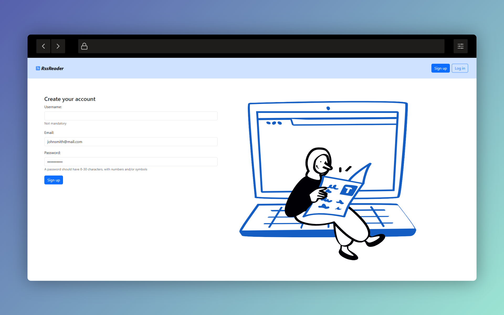
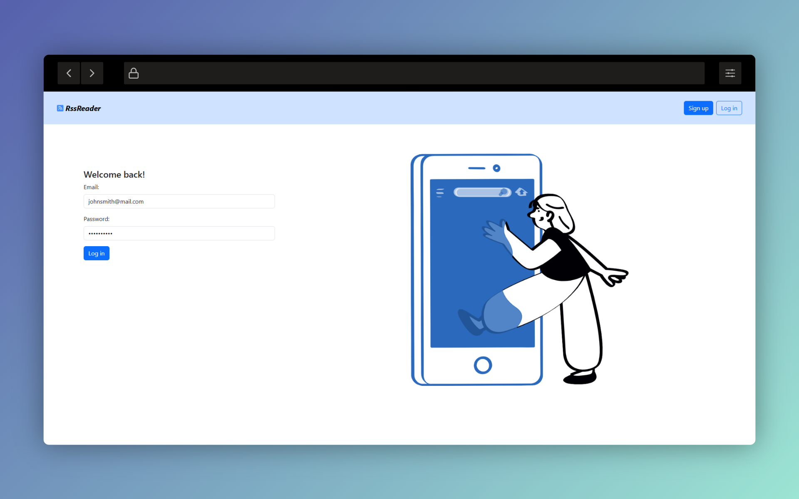
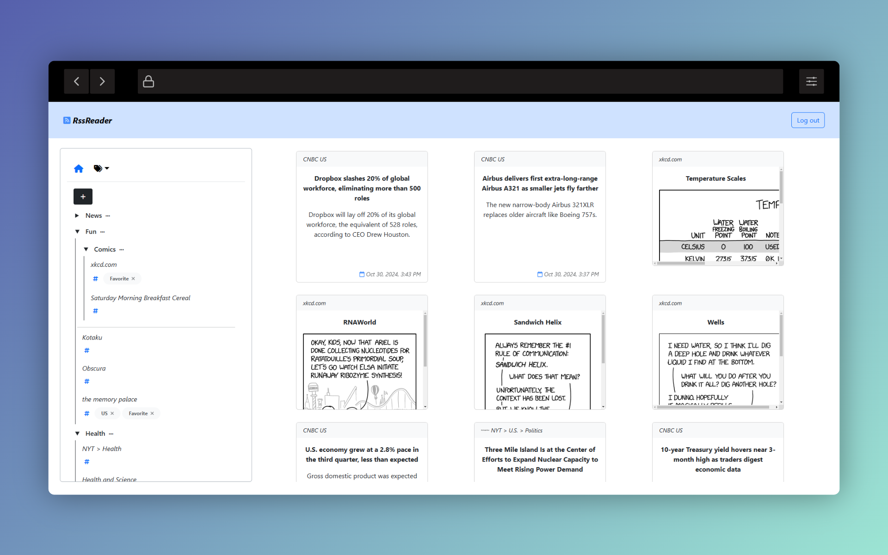
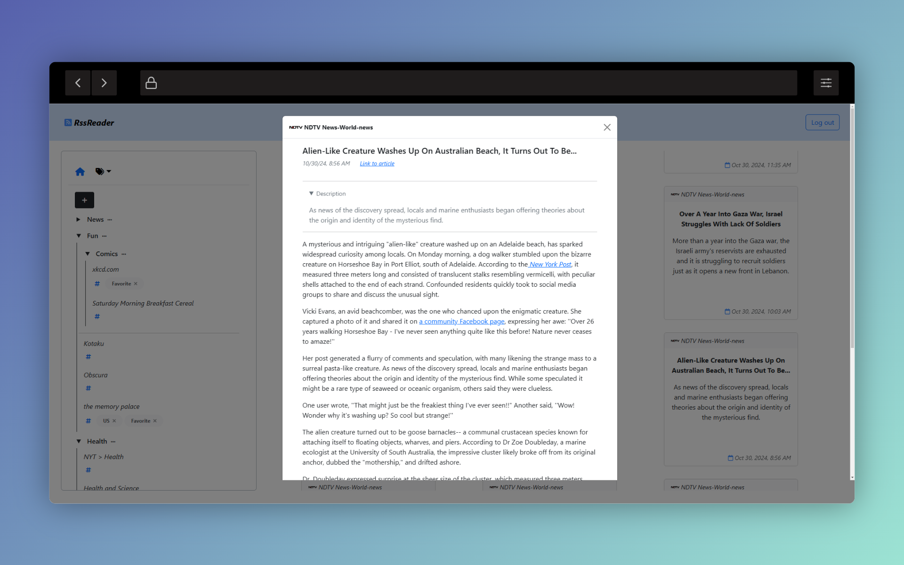
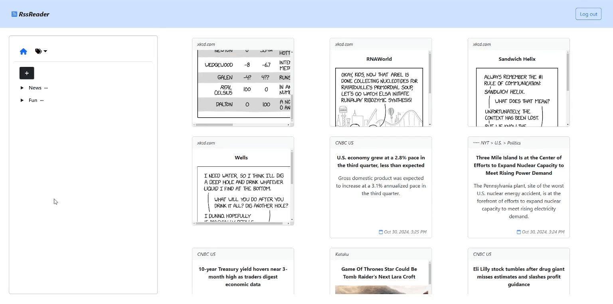

- [ ] dockerize

# RssReader
  

_.Net minimal API_ coupled with a simplistic _Angular frontend_ dedicated to susbcribing and reading RSS feeds

## API
To explore the API endpoints, use the [Swagger editor](https://editor.swagger.io/) to read the [documentation](Misc/api-documentation.json).

Points of note:
- RSS feed susbcriptions utilize both folder- and tag-based organization
- User can filter their feed based on a specific folder, tag, or RSS feed
- Users are subscribed to RSS feeds, rather than creating new ones, so as to cut down on data redundancy
- API utilizes JWT authentication
- API utilizes Redis cache
- API continuously pulls all RSS feeds in the background in 30-second internals

## Frontend
The webpage is a sample showcase of the base functionalities of the API, i.e.:
- Signing up & logging in
- Creating folders and subscriptions
- Adding new tags to a subscription
- Filtering feed view

 
 

